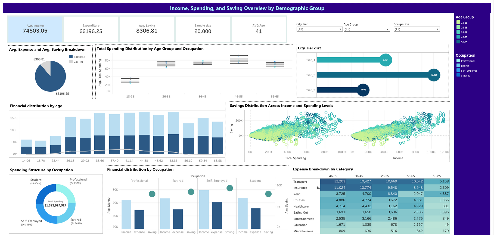
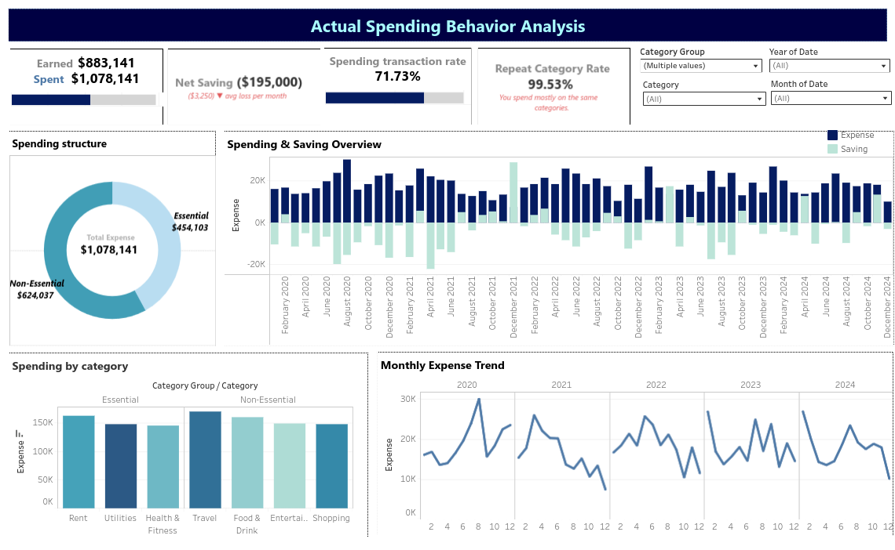

# Personal Finance Dashboard (Tableau)

[Đọc bằng Tiếng Việt](README.vi.md)

## Table of Contents
- [What is this project?](#what-is-this-project)
- [What did I learn?](#what-did-i-learn)
- [Key findings from the data](#key-findings-from-the-data)
- [Proposed improvement](#proposed-improvement)
- [Tools used](#tools-used)
- [What's next?](#whats-next)
- [How to run the project](#how-to-run-the-project)
- [Screenshots](#screenshots)

---

## What is this project?

This project analyzes personal finance behavior — income, spending, and saving — broken down by age group.

Since real user data wasn't available, I **built a synthetic dataset of 20,000 rows** using Python, modeled after real statistics from the U.S. Bureau of Labor Statistics ([bls.gov](https://www.bls.gov/cex/tables.htm)). The data was then visualized using Tableau.

To follow the project end-to-end:

1. **BaoCao_phu_Nhom_10.pdf** — How the dataset was built.
2. **Synthetic_data_generation.ipynb** — Python code for data generation.
3. **BaoCao_Nhom_10.pdf** — Main analytical report.
4. **Income Spending and Saving Overview.twbx** — Population-level dashboard.
5. **Actual Spending Behavior Analysis.twbx** — Individual-level dashboard.

```text
pf-visualization/
├── Reports/         ← PDF reports
├── Notebooks/       ← Python notebooks
├── Dashboards/      ← Tableau files (.twbx)
└── Data/            ← CSV data files
```

---

## What did I learn?

- **Synthetic data generation:** How to use Python (Pandas, NumPy) to create realistic fake data with proper statistical distributions — useful when real data isn't available.
- **Tableau:** Built two interactive dashboards from scratch — KPI cards, filters, trend charts.
- **Segmented analysis:** How to read numbers by demographic groups (age, occupation, city tier) to find meaningful patterns, not just averages.
- **Data storytelling:** Turning a CSV into a clear narrative with actionable conclusions.

---

## Key findings from the data

After running computational analysis (`analyze_pf.py`) on 20,000 rows:

| Age Group | Avg. Savings Rate | What this means |
|-----------|------------------|-----------------|
| 18–25 | **–26.9%** | Spending more than they earn |
| 26–35 | +15.6% | Recovering — building stability |
| 36–45 | **+28.7%** | Best savers in the dataset |
| 46–55 | +1.9% | Near-zero — likely peak family expenses |
| 56–65 | –86.6% | Drawing down savings (likely retired) |

**Surprising finding:** Non-essential spending (dining out, entertainment, misc.) is only **~8%** of total spend — a much smaller share than expected.

> **The real insight:** Young people (18–25) overspend not because of leisure, but because **fixed costs (rent, insurance, transport) already consume most of their income** before discretionary spending even begins.

---

## Proposed improvement

Based on the data, here's a simple experiment I'd suggest to help users manage money better:

### A/B Test: Proactive spending alerts

**The problem:** The 18–25 group is overspending (–26.9%), but the current dashboard only shows what happened after the month is over — too late to change behavior.

**The idea:**

| | Group A (current) | Group B (test) |
|---|---|---|
| Experience | Review spending at end of month | Get an alert before going over budget |
| Example | "You spent $2,000 this month" | "⚠️ You've used 90% of your income with 10 days left" |

**What I'd measure:** After 1 month, does Group B save more than Group A?

**Why this approach makes sense:**
The problem isn't lack of information — users know they're overspending. The problem is they find out **too late**. Switching from reactive reporting to proactive nudging addresses the actual root cause.

---

## Tools used

| Tool | Purpose |
|------|---------|
| Python (Pandas, NumPy) | Data generation and cleaning |
| Tableau | Dashboard design, KPI visualization |
| Excel / Google Sheets | Data validation |

---

## What's next?

- **Real data integration:** Replace synthetic data with actual bank or e-wallet exports.
- **Spending forecasting:** Use a simple model to predict end-of-month balance based on current spending pace.
- **Automation:** Turn the manual notebook workflow into a scheduled pipeline that updates the dashboard automatically.

---

## How to run the project

### Clone the repo

```bash
git clone https://github.com/hoangf384/pf-visualization.git
cd pf-visualization
```

### Set up the environment

```bash
# Create a virtual environment
python -m venv .venv

# Activate it (macOS/Linux)
source .venv/bin/activate
# Activate it (Windows)
.venv\Scripts\activate

# Install dependencies
pip install -r requirements.txt

# Register the kernel for Jupyter
python -m ipykernel install --user --name=.venv --display-name "Python (.venv)"
```

Then open any `.ipynb` file in Jupyter and select the **Python (.venv)** kernel.

---

## Screenshots


[→ View General Dashboard on Tableau Public](https://public.tableau.com/app/profile/nguy.n.phan.ho.ng.ph.c/viz/Book1_17516920190310/General?publish=yes)


[→ View Spending Behavior Dashboard on Tableau Public](https://public.tableau.com/app/profile/nguyen.nhi8170/viz/CuoiKy_17519870918010/Dashboard1?publish=yes)
